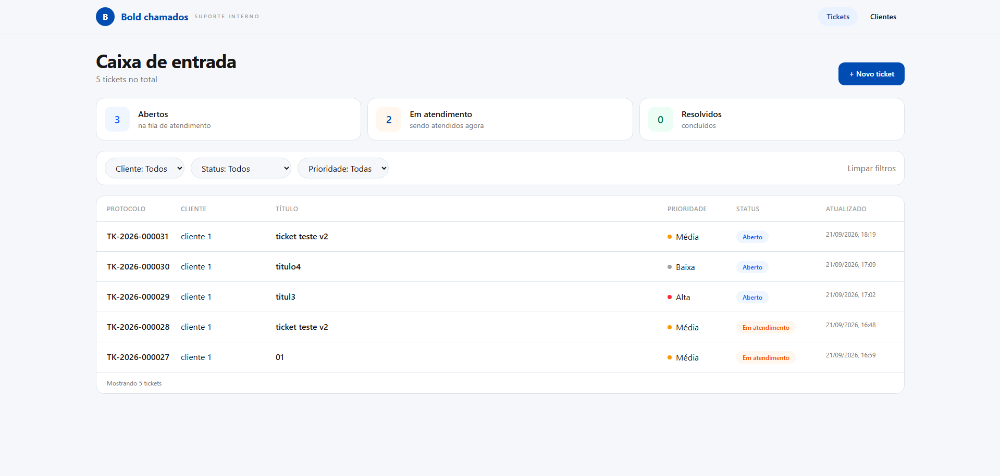
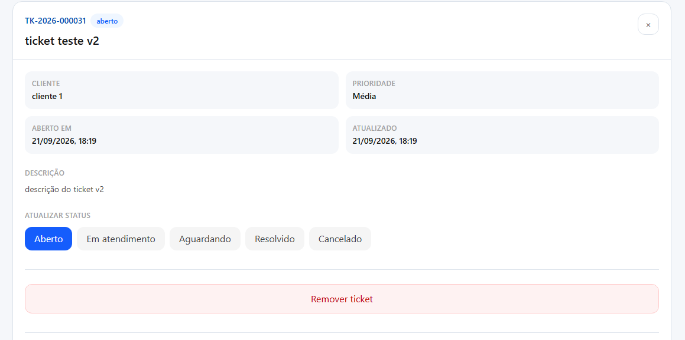
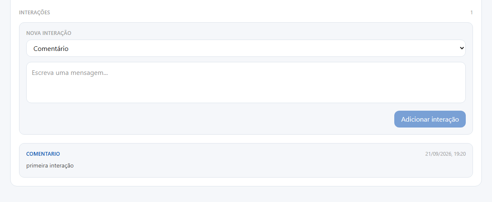
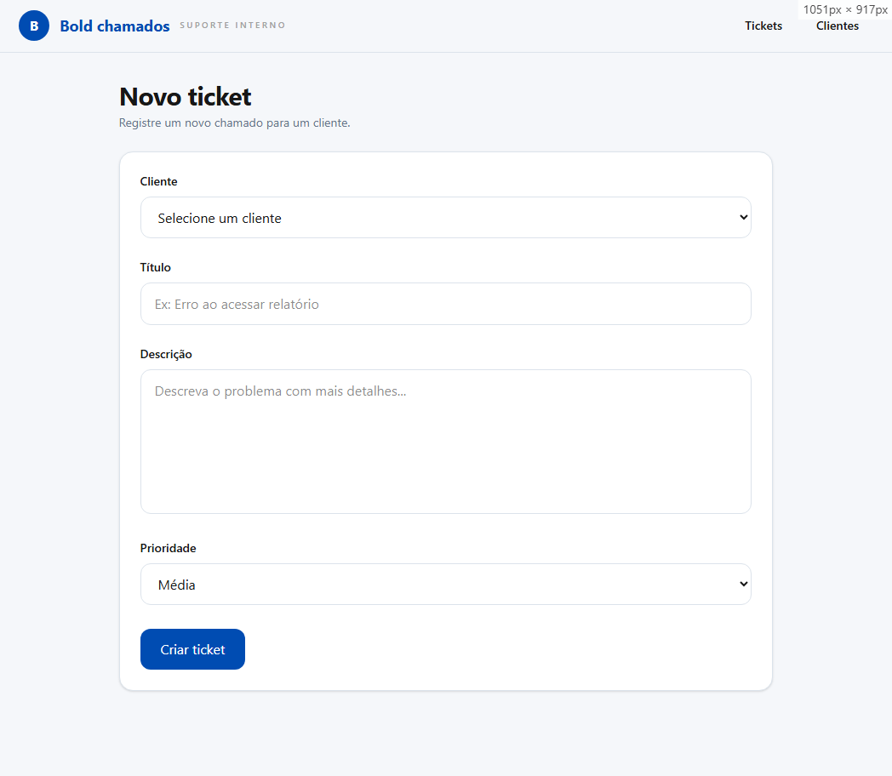
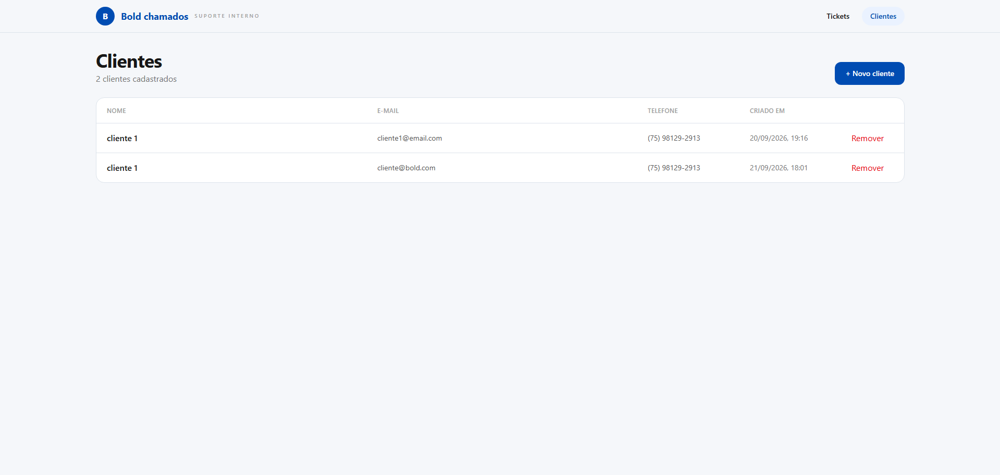
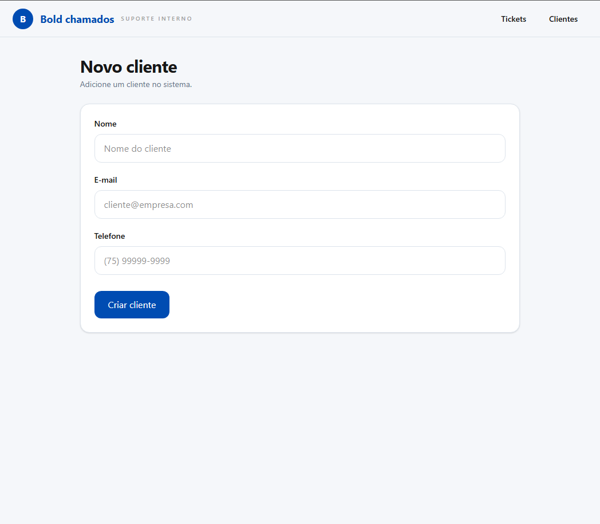

## Configuração

1. Configure o banco PostgreSQL/Supabase.
2. Execute `database/schema.sql`.
3. Configure as credenciais do PostgreSQL no n8n.
4. Importe os workflows JSON presentes em `workflows/`.
5. Configure as URLs/webhooks utilizados pelos workflows.
6. Configure o endpoint de integração externa.
### Frontend

```
cd src/frontend
bun install
bun run dev
```

Configure o `.env` a partir do `.env.example`.

## Tecnologias 
- **n8n**: orquestração da API, validações, regras de negócio e integrações. 
- **PostgreSQL / Supabase**: persistência e constraints.
- **Vue 3 + TypeScript**: frontend com tipos que refletem a API.
- **Pinia**: estado global. 
- **Tailwind CSS**: estilização.
- **Vercel**: deploy do frontend e proxy do endpoint PATCH.
## Arquitetura

```text
Frontend
   │
   ▼
n8n Webhooks
   │
   ├── Validação de entrada
   ├── Regras de negócio
   └── Integração HTTP
   │
   ▼
Supabase / PostgreSQL
```

## API

As rotas são implementadas através de Webhooks do n8n.

### Clientes

| Método | Rota            | Descrição       |
| ------ | --------------- | --------------- |
| GET    | `/clientes`     | Listar clientes |
| GET    | `/clientes/:id` | Buscar cliente  |
| POST   | `/clientes`     | Criar cliente   |
| DELETE | `/clientes/:id` | Remover cliente |

### Tickets

| Método | Rota                      | Descrição                   |
| ------ | ------------------------- | --------------------------- |
| GET    | `/tickets`                | Listar tickets              |
| GET    | `/tickets/:id`            | Buscar ticket               |
| GET    | `/tickets/:id/interacoes` | Listar interações do ticket |
| POST   | `/tickets`                | Criar ticket                |
| POST   | `/tickets/:id/interacoes` | Registrar interação         |
| PATCH  | `/tickets/:id`            | Atualizar status            |
| DELETE | `/tickets/:id`            | Remover ticket              |

## Regras de negócio

- Ticket deve estar vinculado a um cliente existente.
- Status inicial: `aberto`.
- Prioridades válidas:
    - `baixa`
    - `media`
    - `alta`
- Status válidos:
    - `aberto`
    - `em_atendimento`
    - `aguardando_cliente`
    - `resolvido`
    - `cancelado`
- Alteração de status gera uma interação de histórico.

## Integração externa

O n8n também é utilizado para realizar uma chamada HTTP para um sistema externo/mock (atualmente https://webhook.site/) após a criação ou atualização de um ticket.

O evento enviado contém um payload na seguinte estrutura:

```json
{
  "protocolo": "TK-2026-000001",
  "evento": "ticket.criado",
  "status": "aberto"
}
```

## Frontend

O frontend foi organizado para manter o fluxo principal simples e com pouca troca de contexto.

### Fluxo entre telas

```text
Caixa de entrada (/)
   │
   ├──► Novo Ticket (/tickets/novo)
   │       │
   │       └──► após criar, retorna para a Caixa de entrada
   │
   ├──► Selecionar ticket
   │       │
   │       └──► abre painel lateral de detalhes
   │               ├── alterar status
   │               ├── registrar interação
   │               └── excluir ticket
   │
   └──► Clientes (/clientes)
           │
           ├──► Novo Cliente (/clientes/novo)
           │       │
           │       └──► após criar, retorna para Clientes
           │
           └──► remover cliente
````

O fluxo principal parte da Caixa de entrada, onde o usuário acompanha e filtra os tickets.
A seleção de um ticket abre seus detalhes em um painel lateral, evitando uma navegação adicional para operações rápidas.

O cadastro de clientes é separado da gestão de tickets. A tela de criação de ticket carrega os clientes existentes e informa quando é necessário cadastrar um cliente antes de abrir um chamado.

### Caixa de entrada

* Rota: `/`
* Cards de status, filtros e tabela de tickets.
* A seleção de uma linha abre o painel lateral de detalhes.



#### Detalhe do ticket

O painel lateral permite:

* visualizar os dados do ticket;
* consultar o histórico de interações;
* registrar uma nova interação;
* alterar o status;
* excluir o ticket.





### Novo Ticket

* Rota: `/tickets/novo`
* Formulário com validação, carregamento de clientes e aviso caso não existam clientes cadastrados.
* Após a criação, o usuário retorna para a Caixa de entrada.



### Clientes

* Rota: `/clientes`
* Lista os clientes cadastrados.
* Permite remover clientes e navegar para o cadastro de um novo cliente.



### Novo Cliente

* Rota: `/clientes/novo`
* Formulário com validação e máscara de telefone.
* Após o cadastro, o usuário retorna para a listagem de clientes.




### CORS e Vercel Function

A infraestrutura n8n utilizada no desafio não liberava `PATCH` corretamente no preflight CORS do navegador.

Por isso, somente a atualização de status passa por uma Vercel Function:

```
Frontend
   ↓
PATCH /api/tickets/:id/status
   ↓
Vercel Function
   ↓
n8n
```

Arquivo:

```
frontend/api/tickets/[id]/status.ts
```

## Trace logs

A versão v2 registra logs estruturados no PostgreSQL.

Exemplo:

```
{
  "trace_id": "12345",
  "workflow": "Tickets - Criar",
  "evento": "ticket.criado",
  "nivel": "info",
  "status_code": 201,
  "duracao_ms": 180
}
```

## Limitações conhecidas

- Webhook.site utiliza URLs temporárias.
- Não há autenticação/JWT.
- Não há máquina de estados para transições de status.
- Exclusão em cascata de tickets e interações ao remover um cliente e um ticket, respectivamente. 
